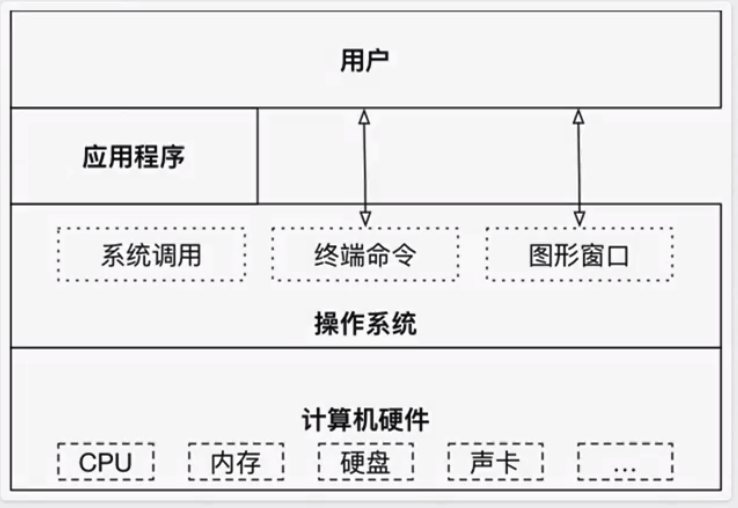
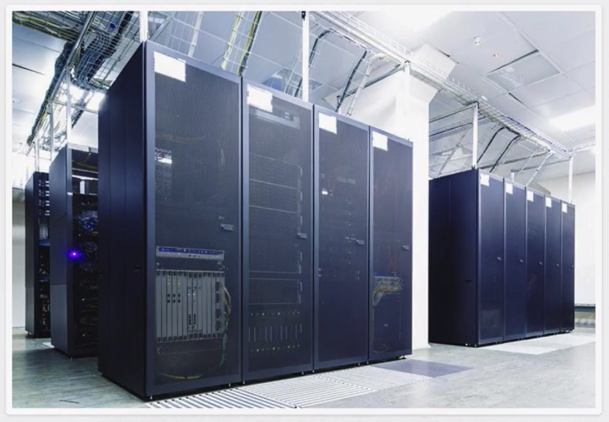

# 03-操作系统科普

## 目标

* 了解**操作系统**及作用

## 1、操作系统（Operation System， OS）

操作系统作为接口的示意图

没有安装操作系统的j计算机，通常被称为 **裸机**。

* 如果想在**裸机**上运行自己所编写的程序，就必须用机器语言书写程序（0和1的组合）。（操作系统可以直接跟硬件打交道）
* 如果计算机上安装了操作系统，就可以在操作系统上安装支持的高级语言环境，用高级语言开发程序。

### 示例

* 播放歌曲

  * 将歌曲文件从硬盘加载到内存中。
  * 使用声卡对歌曲文件进行解码。
  * 将解码后的音频数据发送给音箱。

  操作系统会将以上三步操作都封装成 **系统调用**。程序员在开发音频播放软件的时候，就可以通过调用这些 **系统调用** 来让计算机硬件执行以上三步操作。这样就大大简化了程序员的工作。

### 1.1 操作系统的作用

* 直接操作硬件。
* 将操作硬件的代码封装成一个个系统调用，供程序员通过应用程序调用系统调用来间接操作硬件。

### 1.2 不同领域的主流操作系统

* 桌面操作系统
* 服务器操作系统
* 嵌入式操作系统
* 移动设备操作系统

#### 1.2.1 桌面操作系统

* **Windows 系列**
  * 用户群体大
* **macOS**
  * 适合开发人员
* **Linux**
  * 应用软件少

#### 1.2.2 服务器操作系统

* **Linux**
  * 安全、稳定、免费
  * 占有率高
* **Windows Server**

  * 付费
  * 占有率低

  

#### 1.2.3 嵌入式操作系统

* **Linux**

#### 1.2.4 移动设备操作系统

* **iOS**
* **Android\(基于Linux\)**

### 1.3 虚拟机

虚拟机（Virtual Machine）指通过软件模拟的具有完整硬件系统功能的、运行在一个完全隔离环境中的计算机系统。

* 虚拟系统通过生成现有操作系统的全新虚拟镜像，具有真实操作系统完全一样的功能
* 进入虚拟操作系统后，所有操作都是在这个全新的独立的虚拟系统里面进行，可以独立安装运行软件，保存数据，拥有自己的独立桌面，不会对真正的系统产生任何影响
* 而且能够在现有系统与虚拟镜像之间灵活切换的一类操作系统

