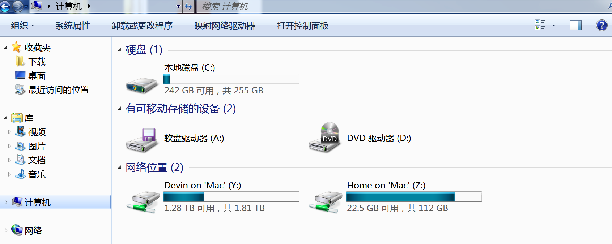
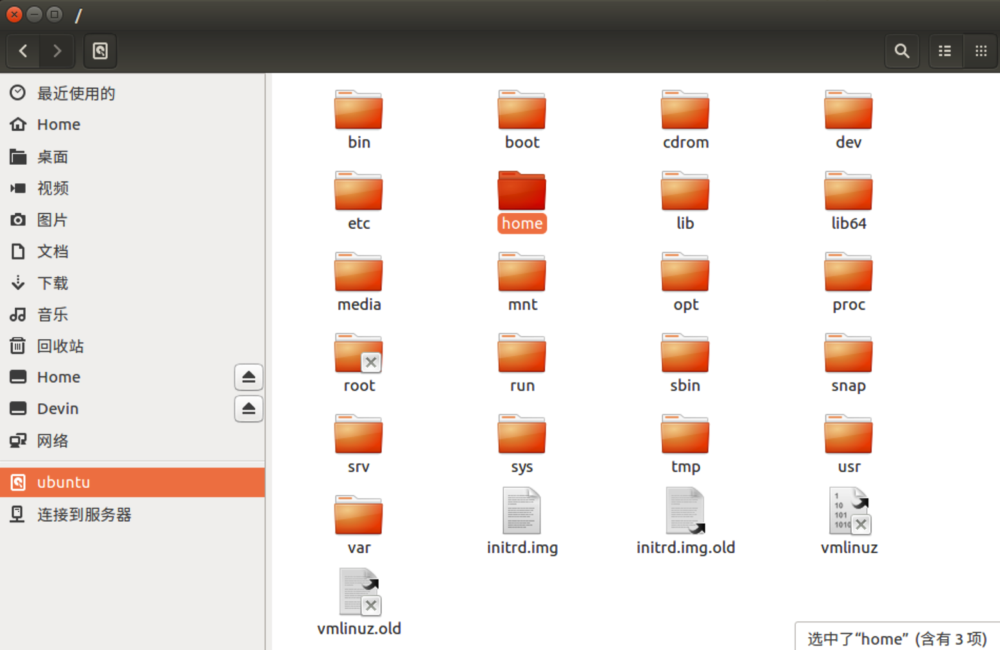
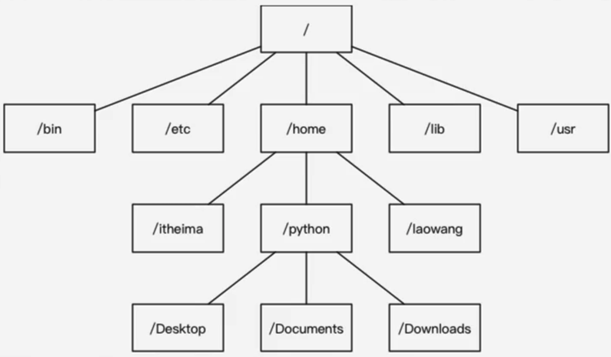

# 06-Linux操作系统的文件和目录结构

## 目标

* 理解 Linux 文件目录的结构

## 1、单用户操作系统和多用户操作系统

* **单用户操作系统**: 指一台计算机在同一时间 **只能由一个用户** 使用，一个用户独自享用系统的全部硬件和软件资源。
  * **Windows XP** 之前的版本都是单用户操作系统
* **多用户操作系统**: 指一台计算机在同一时间可以由 **多个用户** 使用，多个用户共同享用系统的全部硬件和软件资源
  * Unix 和 Linux 设计的初衷就是多用户操作系统

## 2、Windows 和 Linux 文件系统区别

### 2.1 Windows 下的文件系统

* 在 `Windows` 下，打开 **计算机，**我们会开到一个个的驱动盘符:

* 每个驱动器都有自己的根目录结构，这样就形成了多个树并列的情形，如图所示:

### 2.2 Linux 下的文件系统

* 在 `Linux` 下，我们是看不到这些驱动器盘符的，我们看到的是文件夹（目录）：

* `Ubuntu` 没有盘符这个概念，只有一个 **根目录`/`**，所有的文件都在它下面:

